```
╔═══════════════════════════════════════════════════════════════════════════════════════╗
║                                                                                       ║
║   OLUWAKEMI ATOYEBI                                                                  ║
║   ──────────────────                                                                  ║
║   Full-Stack Developer · Smart Contract Engineer · Solidity DevRel                    ║
║   Scrimbassador · Web3Bridge Mentor · Writer                                          ║
║                                                                                       ║
║   Onchain.                                                               she/her      ║
║                                                                                       ║
╚═══════════════════════════════════════════════════════════════════════════════════════╝
```

<br>

> _"The best code, like the best stories, makes the complex feel inevitable."_

<br>

### Chapter One: The Plot

I build full-stack dApps on Ethereum and its scaling solutions — from pixel-perfect frontends to gas-optimized Solidity — and then I write about the things I build. My second job is making blockchain feel less alien: breaking down complex Web3 concepts so they land with people who aren't neck-deep in whitepapers.

Currently: building onchain, doing Solidity DevRel at [Dev3Pack](https://dev3pack.com), mentoring the next wave of Web3 developers at [Web3Bridge](https://www.web3bridgeafrica.com/), and helping people learn to code as a [Scrimbassador at Scrimba](https://scrimba.com/?via=u0j80o).

<br>

### Chapter Two: The Arsenal

<details>
<summary><b>⌁ Languages</b> — the ones I think in</summary>
<br>


</details>

<details>
<summary><b>⌁ Frontend</b> — where the user lives</summary>
<br>


</details>

<details>
<summary><b>⌁ Web3</b> — where the money lives</summary>
<br>


</details>

<details>
<summary><b>⌁ Tools</b> — the rest of the toolkit</summary>
<br>


</details>

<br>

### Chapter Three: Off the Clock

I believe the best way to learn something deeply is to explain it clearly — so I write about blockchain, DeFi, and the tools developers actually use, breaking things down without dumbing them down. Outside of tech, I'm usually lost in a good book, watching something worth talking about, or planning a trip to somewhere I haven't been yet.

<br>

### Chapter Four: Say Something

Not a "let's connect" person. More of a "send me something interesting and let's see what happens" person.

<a href="https://x.com/Haramide"></a>
<a href="https://www.linkedin.com/in/oluwakemi-atoyebi"></a>
<a href="mailto:atokemmy@gmail.com"></a>
<a href="https://medium.com/@atokemmy"></a>
<a href="https://scrimba.com/?via=u0j80o"></a>

<br>

---

### The Numbers

<div align="center">
  <a href="https://github.com/Khemmie-Ray">
    
  </a>
  <a href="https://github.com/Khemmie-Ray">
    
  </a>
</div>

---

<sub>Banner credit: Jonas Mosesson</sub>
